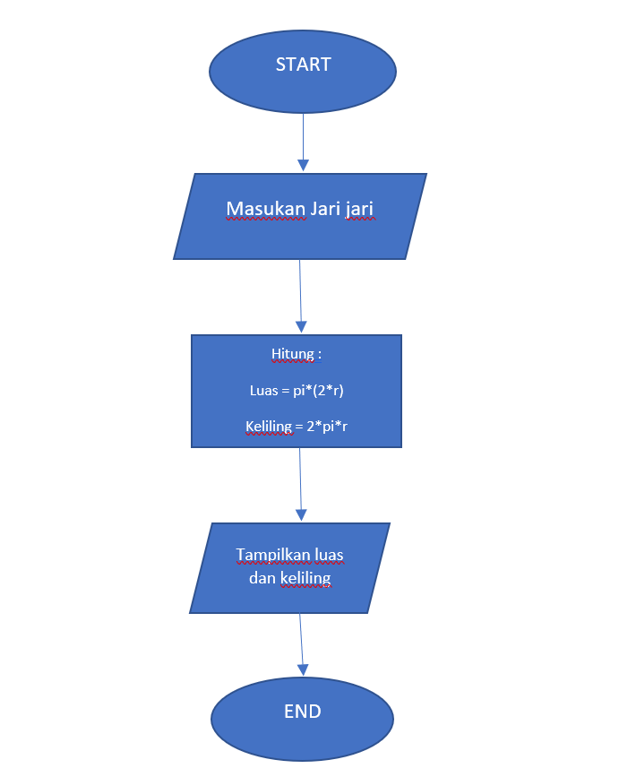
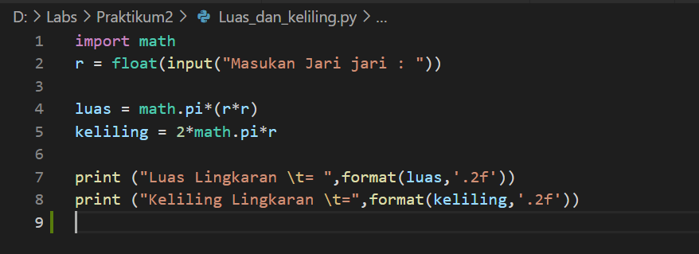
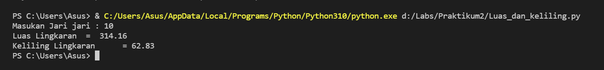
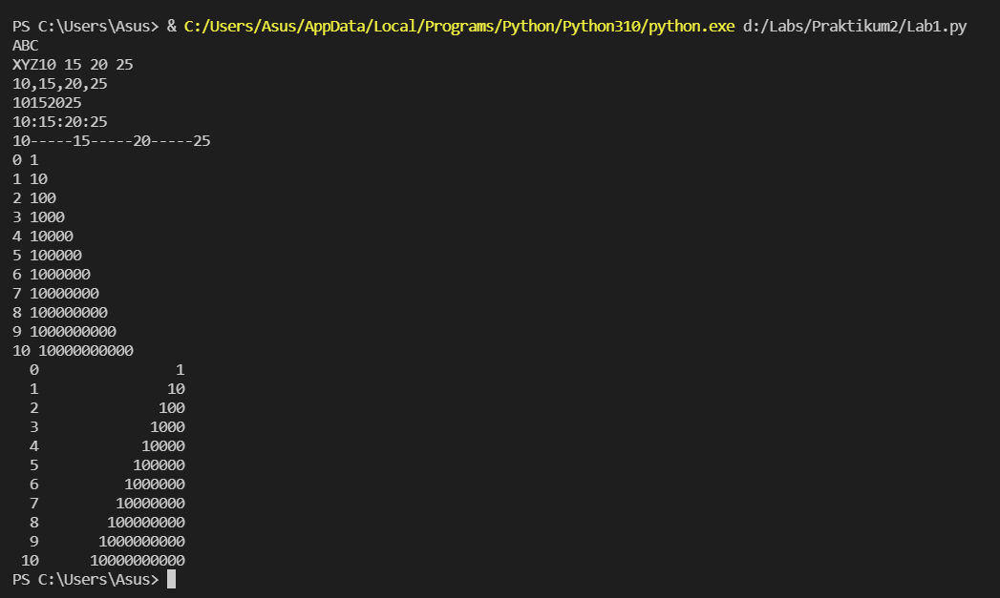
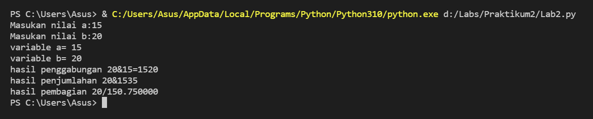

# Praktikum2

## Diketahui rumus luas dan keliling lingkaran
 Luas = Phi x r2(kuadrat)  
 Keliling = 2 x Phi x r   
 Nilai Phi yang digunakan adalah 3.14    
 r merupakan jari jari lingkaran  

## Buat ke dalam flowchart

##  Penjelasan program

Perintah math.pi jika kita coba cetak fungsi tersebut maka akan menghasilkan nilai 3.14.   
Sintak /t merupakan karakter espace yang berfungsi untuk membuat tabdalan kasus ini agar sejajar karakter dengan (=) nya.   
Dengan menggunakan fungsi format(luas,'.2f')akan menghasilkan 2 angka pecahan dibelakang koma.  

## Hasil eksekusi program luas dan keliling lingkaran

## Hasil dari latihan Lab 1

## Hasil dari latihan Lab 2

## SELESAI